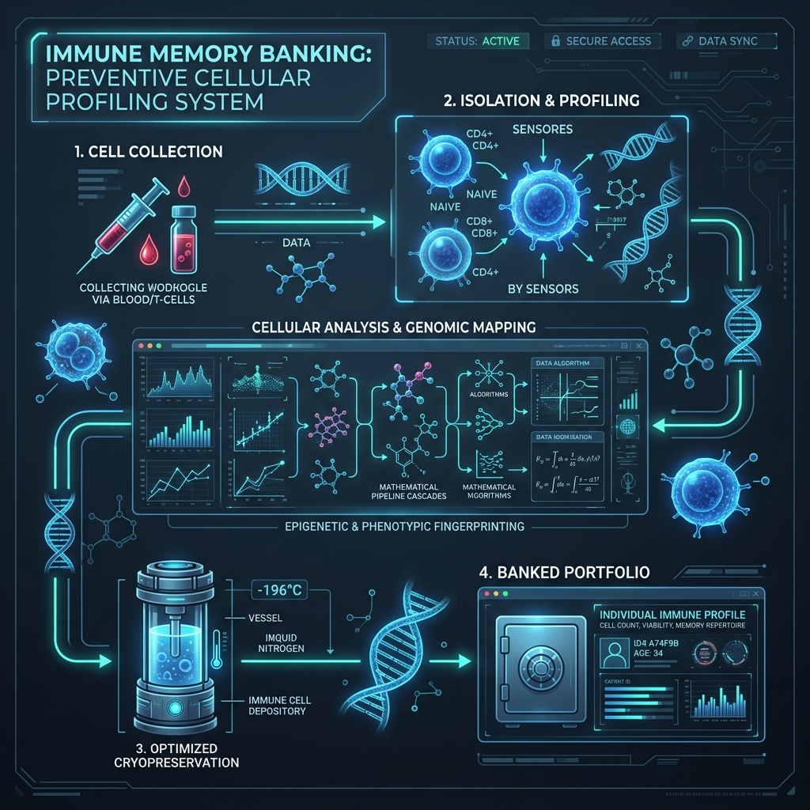

# Immune X — Technical & Mathematical Engine Report

This report provides a detailed technical specification of the Immune X MVP calculation engine, including the mathematical formulas, pipeline architecture, and cascading scoring dependencies.

---

## 🖼️ System Pipeline Overview

Below is the design concept representing the cell profiling, mathematical cascading, and immune bank eligibility pipeline of the Immune X platform:



---

## 🛠️ Pipeline Architecture & Data Flow

The platform separates validation, mathematical calculation, and user presentation. The engine uses **Pydantic** to enforce data integrity and standard validation rules (e.g. bounding input values strictly between 0 and 100).

The overall process flows as follows:
1. **Input Stage**: The user supplies 23 raw parameters in the UI (grouped by Biomarkers, Demographics/Lifestyle, Medical History, and Temporal/Historical Data).
2. **Clinical Normalization**: Raw values (like CRP in mg/L or CD4/CD8 ratio) are scaled to a standard 0-100 score using clinical reference curves in `src/utils/helpers.py`.
3. **Pydantic Validation**: Parameters are parsed into the `ImmuneInputs` schema class.
4. **Intermediate Equation Phase**: Calculations 1 through 6 are performed sequentially, deriving supporting metrics.
5. **Core Equation Phase**: Core scores (IMQS, BES, IDRS, ReBankingIndex, and IHI) are calculated by drawing from both the raw inputs and the freshly calculated intermediate scores.
6. **Output Presentation**: Outputs are parsed into the `ImmuneOutputs` model and displayed on the interactive Streamlit dashboard.

---

## 🧮 Detailed Mathematical Formulas

### A. Supporting Equations (Stage 1)

These 5 equations calculate intermediate profiles used in subsequent core scores.

#### 1. Inflammation Score (IS)
Combines three prominent pro-inflammatory biomarkers (CRP, IL-6, and TNF-alpha) to measure systemic inflammation.
$$IS = 0.40(CRP) + 0.30(IL6) + 0.30(TNFa)$$

#### 2. Lifestyle Score (LS)
Synthesizes physical habits (exercise, sleep, body composition, and smoking).
$$LS = 0.30(Exercise\_Score) + 0.30(Sleep\_Score) + 0.20(BMI\_Score) + 0.20(Smoking\_Score)$$

#### 3. Vaccine Response Score (VRS)
Estimates adaptive immune reactivity based on peak titers and antibody half-life.
$$VRS = 0.50(Antibody\_Response) + 0.30(T\_cell\_Response) + 0.20(Response\_Durability)$$

#### 4. Health Score (HS)
Establishes the patient's general physiological base fitness.
$$HS = 0.35(Metabolic\_Score) + 0.35(Cardiovascular\_Score) + 0.30(Immune\_Health\_Base\_Score)$$

#### 5. Age Factor (AF)
Calculates a relative aging index representing expected lifespan remaining.
$$AF = 100 - \left(\frac{Age}{Expected\_Lifespan} \cdot 100\right)$$

---

### B. Core Equations (Stage 2)

These equations produce the primary clinical indicators shown in the dashboard.

#### 6. Immune Age Gap
Represents biological immune age acceleration. Negative values denote a younger, healthier immune profile.
$$ImmuneAgeGap = ImmuneAge - Age$$

#### 7. Immune Memory Quality Score (IMQS)
Evaluates the quantity and quality of antigen-experienced cells. It relies on T Memory Stem Cells ($T_{SCM}$), T-cell Receptor Diversity ($TCRD$), Naive T cells, and intermediate indicators ($VRS, IS, LS, AF$).
$$IMQS = 0.25(TSCM) + 0.20(TCRD) + 0.15(CD4\_CD8\_Ratio) + 0.10(NaiveT) + 0.10(VRS) + 0.10(IS) + 0.05(LS) + 0.05(AF)$$

#### 8. Biobanking Eligibility Score (BES)
Determines if a patient's immune cells are high quality enough to bank. The $AgeFactor$ (AF) represents the $AgeScore$ in this calculation.
$$BES = 0.60(IMQS) + 0.20(HS) + 0.20(AgeFactor)$$

#### 9. Immune Decline Risk Score (IDRS)
Estimates the rate of immunosenescence.
$$IDRS = 0.30(IS) + 0.25(ImmuneAgeGap) + 0.15(BMI\_Score) + 0.15(Smoking\_Score) + 0.15(Comorbidity\_Score)$$

#### 10. Re-Banking Index (RBI)
Used to flag if previous biobanked samples need updating or cell boosting.
$$ReBankingIndex = 0.50(DeltaImmuneAge) + 0.30(DeltaIMQS) + 0.20(IDRS)$$

#### 11. Immune Health Index (IHI)
The high-level overall summary metric of immune system durability.
$$IHI = 0.40(IMQS) + 0.30(100 - IDRS) + 0.30(BES)$$

---

## 🔗 Cascading Dependency Map

The engine is highly optimized; instead of asking the user to manually calculate and input scores, the calculation engine forms a directed acyclic dependency graph (DAG) where outputs cascade:

```text
               ┌── [ CRP, IL6, TNFa ] ──────────────────> Inflammation Score (IS) ──┐
               ├── [ Exercise, Sleep, BMI, Smoking ] ────> Lifestyle Score (LS) ────┤
               ├── [ Antibody, T_cell, Durability ] ────> Vaccine Score (VRS) ─────┤
               ├── [ Age, Expected_Lifespan ] ──────────> Age Factor (AF) ─────────┼──> IMQS ──┐
               │                                                                   │           │
[ Raw Inputs ] ├── [ TSCM, TCRD, CD4_CD8_Ratio, NaiveT ] ──────────────────────────┘           │
               ├── [ Metabolic, Cardiovascular, Base ] ──> Health Score (HS) ──────────┐       ├──> BES ──┐
               │                                                                       │       │          │
               ├── [ ImmuneAge, Age ] ──────────────────> Immune Age Gap ──┐           ├──> ───┼──> ──────┼──> IHI
               │                                                           ├──> IDRS ──┤       │          │
               ├── [ Comorbidity ] ────────────────────────────────────────┘     │     │       │          │
               │                                                                 ▼     │       │          │
               └── [ DeltaImmuneAge, DeltaIMQS ] ────────────────────────> ReBankingIndex ┘       ┘          ┘
```

---

## 🎯 Implementation details

All calculations are encapsulated inside the package function:
* `src.engine.calculations.calculate_immune_metrics`

Input structures are checked against strict Pydantic requirements:
* `src.engine.schemas.ImmuneInputs`

This design ensures that if any mathematical equation is replaced in the future with a machine learning model, only the model execution logic inside `src.models/` needs to change; the validation boundary, API structure, and frontend Streamlit app will remain completely untouched.
